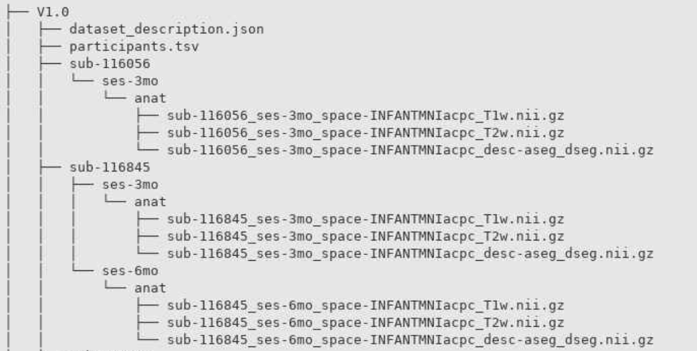
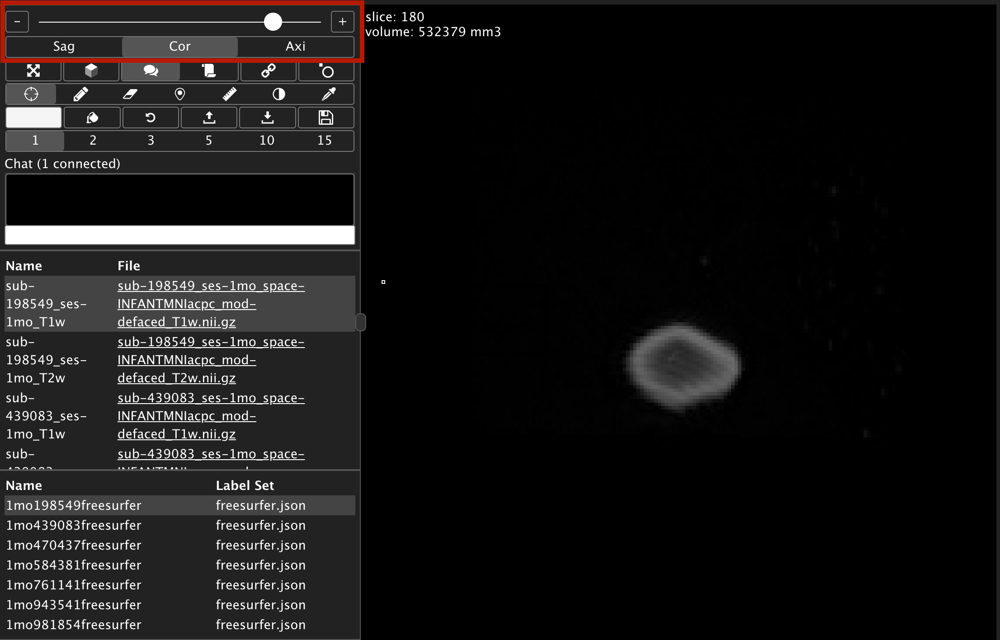
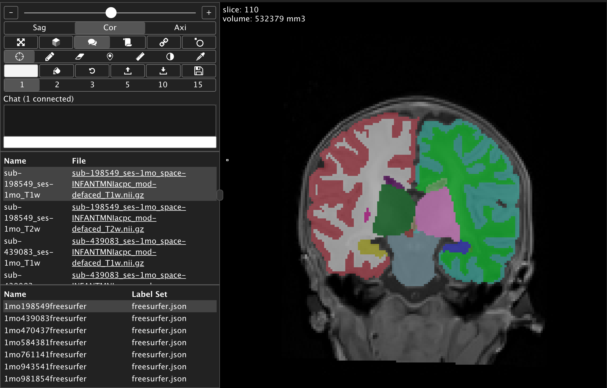
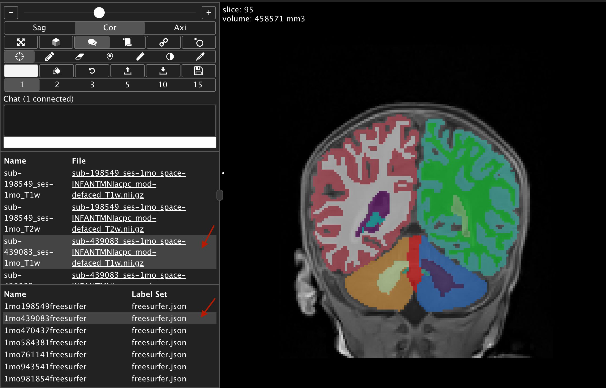

# View or Download Data

## Organization of BOBS Repository Data
The data structure and filenaming are organized following [BIDS standards](https://bids.neuroimaging.io/). The BIDS directory contains `dataset_description.json` and `participants.tsv` files (that contain a description of the dataset and list of subject IDs and sessions, respectively) in addition to participant folders named by subject ID. Each subject folder contains session folders that indicate the age at which the MRI images were acquired (eg ses-1mo means that the data was acquired at 1 month old chronological age). The T1w and T2w image files and accompanying segmentation files are located in the `anat` subdirectory under session.

Here is an example of the directory structure using fake subject ID numbers:

## How to Download 

Explore the repository contents and download individual files by clicking [here](https://bobsrepository.s3.amazonaws.com/index.html). For a comprehensive download of the entire V1.0 repository, click on [`Download Entire Repository`](https://bobsrepository.s3.us-east-2.amazonaws.com/V1.0.zip) at the bottom of the page.

The contents of the repository are also accessible and can be downloaded anonymously using open-source clients such as [Cyberduck](https://cyberduck.io/).
  
## Viewing the data on BrainBox 

If you wish to simply view the brain segmentations overlaid on their associated T1w and T2w images, we have created repositories on BrainBox for each of the age bins located here:

[BOBsRepository1mo](https://brainbox.pasteur.fr/project/BOBsRepository1mo)  
[BOBsRepository2mo](https://brainbox.pasteur.fr/project/BOBsRepository2mo)  
[BOBsRepository3mo](https://brainbox.pasteur.fr/project/BOBsRepository3mo)  
[BOBsRepository4mo](https://brainbox.pasteur.fr/project/BOBsRepository4mo)  
[BOBsRepository5mo](https://brainbox.pasteur.fr/project/BOBsRepository5mo)  
[BOBsRepository6mo](https://brainbox.pasteur.fr/project/BOBsRepository6mo)  
[BOBsRepository7mo](https://brainbox.pasteur.fr/project/BOBsRepository7mo)  
[BOBsRepository8mo](https://brainbox.pasteur.fr/project/BOBsRepository8mo)

The link will direct you to the first subject in the repository. To scroll, use the bar at the top left. 

 

After selecting another subject's anatomical image to view, remember to also select the label set json with the matching subject ID to see the segmentation overlay. To select another subject to open in a new window, click the full file name, otherwise just click the space to the right of the file name to just change the subject within the frame (see arrows below). 

