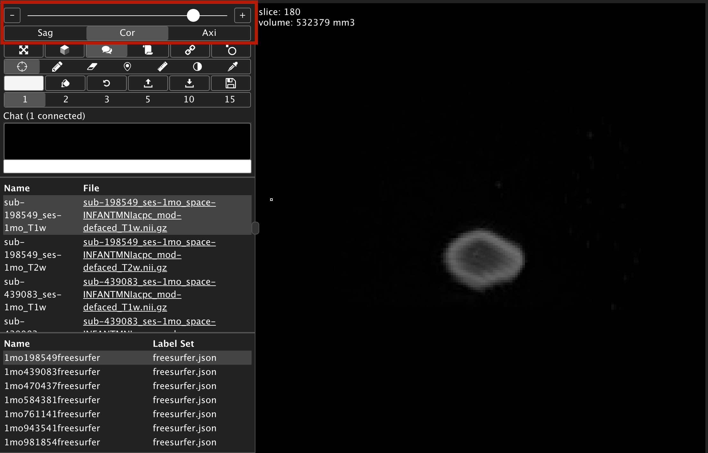
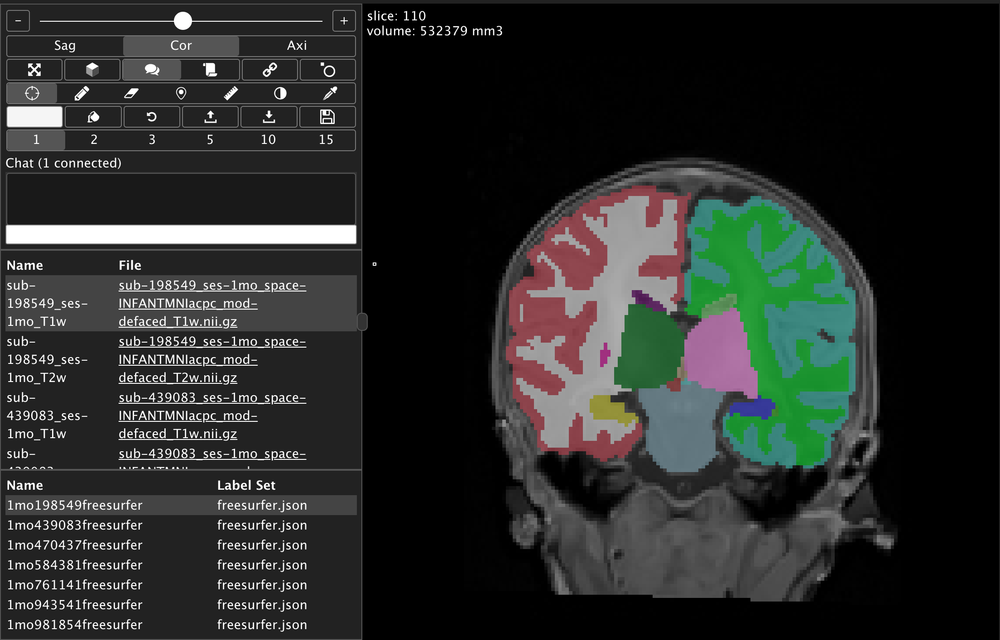
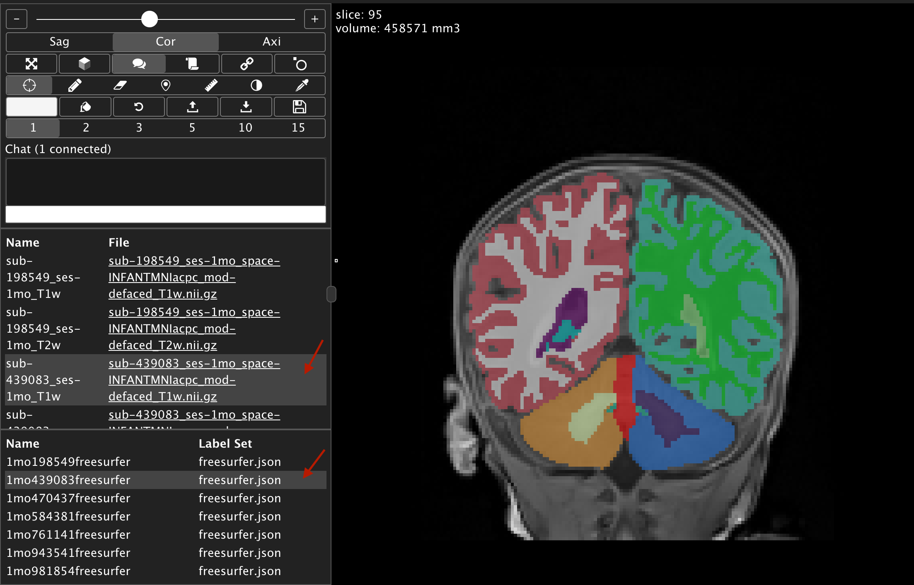
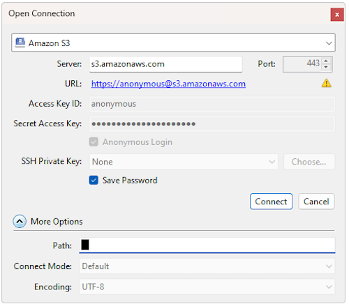
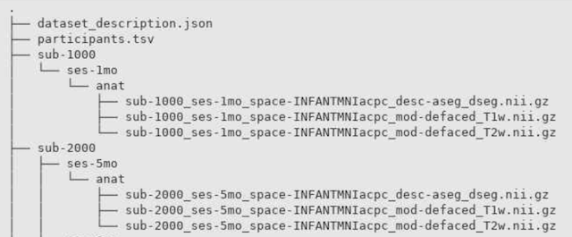

# How to Access the Repository
  
## Viewing the data on BrainBox - *TO DO: add screenshots*

If you wish to simply view the brain segmentations overlaid on their associated T1w and T2w images, we have created repositories on BrainBox for each of the age bins located here:

[BOBsRepository1mo](https://brainbox.pasteur.fr/project/BOBsRepository1mo)  
[BOBsRepository2mo](https://brainbox.pasteur.fr/project/BOBsRepository2mo)  
[BOBsRepository3mo](https://brainbox.pasteur.fr/project/BOBsRepository3mo)  
[BOBsRepository4mo](https://brainbox.pasteur.fr/project/BOBsRepository4mo)  
[BOBsRepository5mo](https://brainbox.pasteur.fr/project/BOBsRepository5mo)  
[BOBsRepository6mo](https://brainbox.pasteur.fr/project/BOBsRepository6mo)  
[BOBsRepository7mo](https://brainbox.pasteur.fr/project/BOBsRepository7mo)  
[BOBsRepository8mo](https://brainbox.pasteur.fr/project/BOBsRepository8mo)

The link will direct you to the first subject in the repository. To scroll, use the bar at the top left. 

 

After selecting another subject's anatomical image to view, remember to also select the label set json with the matching subject ID to see the segmentation overlay. To select another subject to open in a new window, click the full file name, otherwise just click the space to the right of the file name to just change the subject within the frame (see arrows below). 

## How to Download 

### Option 1: Quick Download Option

Click [here](https://bobsrepository.s3.amazonaws.com/bobsrepository.zip) to download a zip file containing the full contents of the repository via your web browser 

### Option 2: Using Cyberduck to download data locally

You can also use [Cyberduck](https://cyberduck.io/) to download the BOBs Repository image files locally. We often recommend this route as you can view the file structure and select individual files before downloading. After downloading and opening Cyberduck, do the following to connect to the data repository bucket stored on Amazon Web Services S3 bucket:

1. Click *Open Connection*
2. In the dropdown menu at the top of the dialogue box, select *Amazon S3* and the Server box will automatically populate with *s3.amazonaws.com*
4. Check *Anonymous Login* (if you are unable to check this box, type "anonymous" into the Access Key ID field instead) 
5. Expand the More Options tab and enter for Path: `future/path/to/data`
6. Click *Connect*

## Organization of BOBS Repository Data
The top-level directory contains all participants folders named by subject ID, each of which contains session folders that indicate the age at which the MRI images were acquired (eg ses-1mo acquired at 1 month old chronological age). The T1w and T2w image files and accompanying segmentation files are located in the `anat` subdirectory under session following [BIDS Derivatives](https://bids-specification.readthedocs.io/en/stable/derivatives/introduction.html) data structure requirements.

In addition, the top-level directory also contains 2 files: a `dataset_description.json` and `participants.tsv` file that contain a description of the dataset and list of subject IDs and sessions, respectively, following [BIDS specification](https://bids-specification.readthedocs.io/en/stable/modality-agnostic-files.html#modality-agnostic-files). 

Here is an example of the directory structure using fake subject ID numbers:

